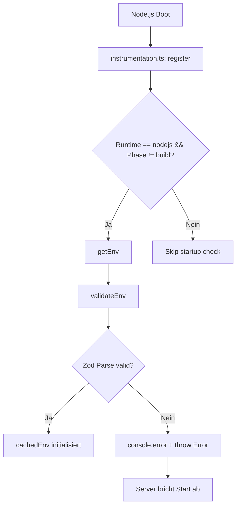

# Developer Notes: env-lazy-und-docker-secrets

## Überblick

Dieses Refactoring löst die Kopplung zwischen Secrets zur Buildzeit und der Next.js Build-/Testumgebung auf. 
Durch die Umstellung auf lazy geladene Umgebungsvariablen können Builds und automatisierte Tests ohne eine lokale `.env` oder API-Schlüssel ausgeführt werden. Zum Laufzeit-Startup sichert eine Next.js-Instrumentation die Integrität der erforderlichen Pflicht-Variablen ab.

## Referenzen

- Plan: `docs/project/features/env-lazy-und-docker-secrets/plan-v001.md`
- PRD: `docs/PRD.md` (indirekt)
- Relevante Guides: 
  - `docs/coding-guidelines/03-typescript-quality.md`
  - `docs/coding-guidelines/08-error-handling-logging.md`

## Betroffene Dateien

| Datei | Zweck / Änderung |
|---|---|
| `lib/config/env.ts` | Umstellung der eagerly-validierten Zod-Schemas auf eine lazy Funktion `getEnv()`. `MAPBOX_ACCESS_TOKEN` wurde als optional deklariert. |
| `lib/core/prisma.ts` | Entfernung des eager Import-Seiteneffekts von `env.ts`. |
| `instrumentation.ts` | Neuer Next.js Startup Hook für die Validierung der Pflicht-Umgebungsvariablen beim Booten des Node.js-Servers. |
| `__tests__/lib/config/env.test.ts` | Neue Unit-Tests für `getEnv()` (Erfolgsfall, Validierungsfehler bei fehlenden Pflicht-Keys, Mapbox-Optionalität und Memoisierung). |
| `Dockerfile` | Entfernung von geheimen Build-Arguments (`ARG`/`ENV`) aus den Build-Stages (`deps`, `build`) sowie Entfernung ungenutzter Debug-Scripte. |
| `deploy/docker-compose.prod.yml` | Bereinigung von geheimen `build.args`. Laufzeit-Variablen bleiben unberührt. |
| `deploy/docker-compose.demo.yml` | Analog zu `prod.yml`. |
| `docs/coding-guidelines/*` | Aktualisierung der betroffenen Guidelines Snippets auf das neue `getEnv()`-Muster. |

## Architektur und Datenfluss

Beim Start der Next.js Server-Instanz wird der Instrumentation-Hook `register()` einmalig aufgerufen. Befindet sich der Server nicht in der Build-Phase und läuft in der Node.js-Laufzeitumgebung, wird `getEnv()` aufgerufen, um alle erforderlichen Variablen zu prüfen. Die gelesenen Werte werden in `cachedEnv` vorgehalten und nachfolgende Aufrufe von `getEnv()` geben den Cache direkt zurück.

## Rollen und Berechtigungen

Nicht relevant (reine Infrastruktur-/Konfigurationsänderung).

## Datenmodell und Persistenz

Nicht relevant (keine Schema-Änderung in Prisma).

## Validierung und Tests

| Prüfung | Ergebnis / Hinweis |
|---|---|
| `npm run test:run` | Alle 273 Tests erfolgreich bestanden (inklusive der neuen Umgebungsvariablen-Tests). |
| `npx tsc --noEmit` | Erfolgreich ohne TypeScript-Fehler durchgelaufen. |
| `npm run lint` | Erfolgreich ohne Warnungen oder Fehler durchgelaufen. |
| CI-Simulation (Build & Test ohne `.env`) | Erfolgreich ausgeführt. Tests und Produktions-Build laufen vollständig ohne lokale `.env` durch. |

## Betriebs- und Setup-Hinweise

- Für das lokale Setup von Entwicklern reicht weiterhin das Kopieren der `.env.example` in `.env`.
- Bei Bereitstellung (Docker/Compose) müssen Secrets zur **Laufzeit** via Environment-Blöcke an den Container übergeben werden (die Build-args benötigen diese Variablen nicht mehr).
- Der Server stürzt ab, falls Pflicht-Variablen wie `DATABASE_URL`, `OPENAI_API_KEY` oder `TOGETHERAI_API_KEY` fehlen.

## Wartungshinweise

- Alle Services lesen Umgebungsvariablen weiterhin über `process.env`. Es ist empfohlen, bei einer Überarbeitung bestehender Services den direkten Zugriff auf `getEnv().VARIABLE` umzustellen.
- `MAPBOX_ACCESS_TOKEN` ist bewusst optional, da `mapboxService.ts` eine eigene Laufzeitprüfung für kartenspezifische Features hat.

## Bekannte Einschränkungen

- Keine bekannt.
